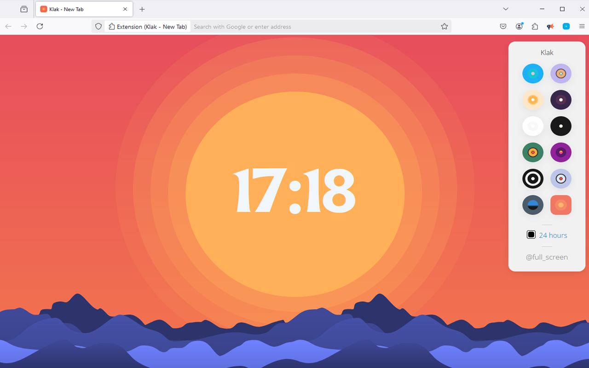

# Klak - New Tab
Digital clock with unique designs for Microsoft Edge or chrome. NEW! + 12 Different design themes available

You are looking for a digital clock without complications.

This extension is a simple clock with many designs to check the time directly in your browser.

(NEW) You can configure:

✓ Change clock time format, 24 hours or 12 hours.
✓ Customize clock background (More than 12 designs available). 

NOTE:

Clock for Microsoft Edge ™ is available in multiple languages.

This digital clock is compatible with the main Microsoft Edge browser with Windows, Mac, Linux and other operating systems.

It is also compatible with Chrome, Edge, Firefox, Safari and Opera browsers.

