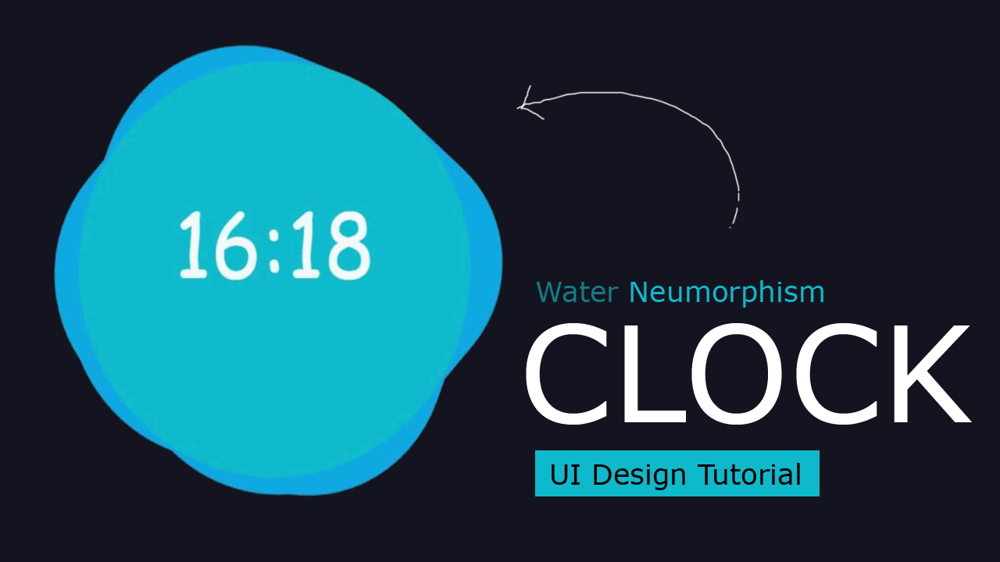

# Water Clock
Digital clock with unique designs for Microsoft Edge. NEW! + 100 Different design themes available
You are looking for a digital clock without complications.

This extension is a simple clock with many designs to check the time directly in your browser.

You will see:

✓ Digital clock.
✓ Day & Date.
✓ Hours, minutes and seconds.
✓ Month.
✓ Year.

(NEW) You can configure:

✓ Change clock time format, 24 hours or 12 hours.
✓ Customize clock background (More than 100 designs available). 
✓ Choose and change your favorite language.
✓ Edit the keyboard shortcut to open the popup (*).

NOTE:

Clock for Microsoft Edge ™ is available in multiple languages.

This digital clock is compatible with the main Microsoft Edge browser with Windows, Mac, Linux and other operating systems.

It is also compatible with Chrome, Edge, Firefox, Safari and Opera browsers.

